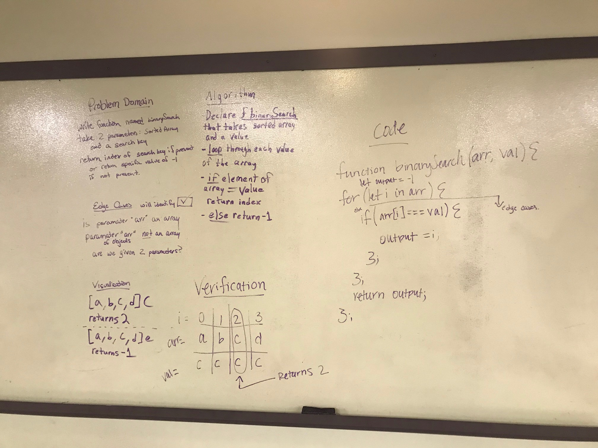

# Insert and shift middle index of array
Code Challenge 02 -- 01 12/19/18 -- Heather Cherewaty, Ryan Gallaway, & Jake Anderson

## Challenge
Per canvas instructions:  Write a function called BinarySearch which takes in 2 parameters: a sorted array and the search key. Without utilizing any of the built-in methods available to your language, return the index of the array’s element that is equal to the search key, or -1 if the element does not exist.

## Approach & Efficiency
Collaborative effort whiteboarding with Ryan & Jake:
    - Identified problem domain
    - Visualized solution
    - Formulated an algorithm
    - Wrote code for the insertShiftArray function
    - Verification step
    - Tested code in repl to be sure it worked
    - Wrote tests for code

## Solution
