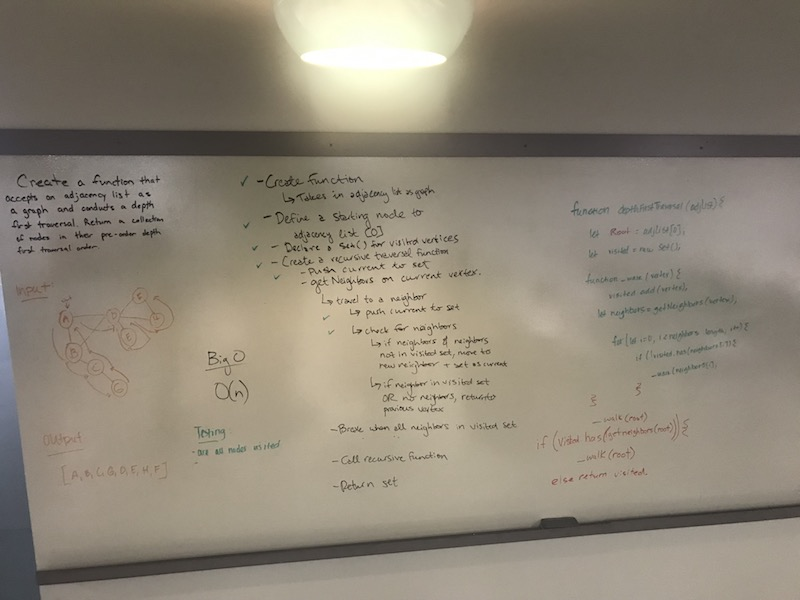

# Depth First Traversal
Conduct a depth first preorder traversal on a graph

## Author:  Heather Cherewaty
### Collaborated with Becca Lee and Brent Woodward

## Challenge
Create a function that accepts an adjacency list as a graph, and conducts a depth first traversal. Without utilizing any of the built-in methods available to your language, return a collection of nodes in their pre-order depth-first traversal order.

## Approach & Efficiency
Attempted to solve recursively by checking for neighbors from starting point and traversing to neighbors, if they exist, and adding to visited set.  
Space and time is O(n)

## Solution
