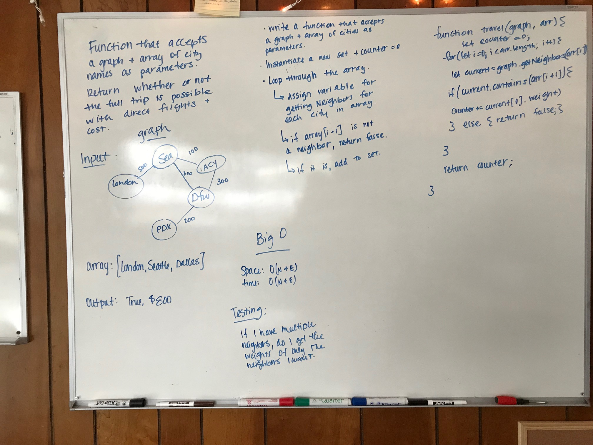

## Challenge
### 2/12/19 

#### Author:  Heather Cherewaty
#### Collaborated with:  Becca Lee

#### Implement a getEdge function that:
* Write a function based on the specifications above, which takes in a graph, and an array of city names. Without utilizing any of the built-in methods available to your language, return whether the full trip is possible with direct flights, and how much it would cost.

## Approach & Efficiency

* Function that takes in a graph and an array of cities
* Found neighbors of starting node
* Iterated over neighbors, adding value of node to counter

#### UML
