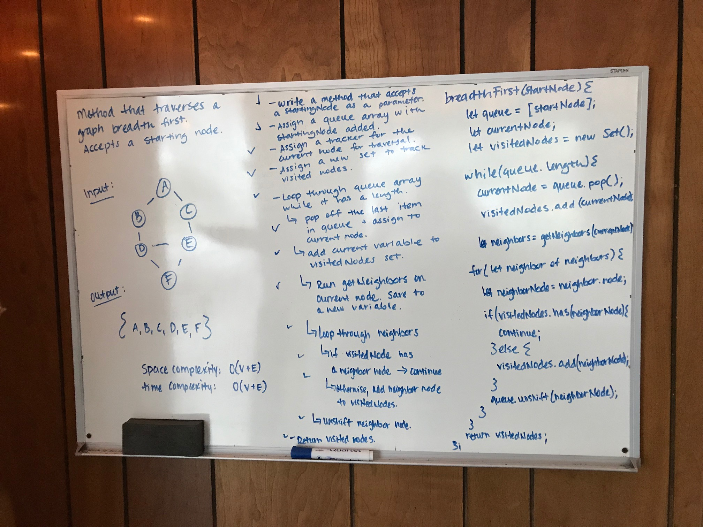

# Graphs

## Author:  Heather Cherewaty

## Challenge
### 2/10/19 

#### Implement a Graph represented as an adjacency list with the following methods:

* `AddNode()`
    * Adds a new node to the graph.
    * Takes in the value of that node.
    * Returns the added node.
* `AddEdge()`
    * Adds a new edge between two nodes in the graph.
    * Include the ability to have a “weight”.
    * Takes in the two nodes to be connected by the edge.
        * Both nodes should already be in the Graph.
* `getNodes()`
    * Returns all of the nodes in the graph as a collection (set, list, or similar).
* `getNeighbors()`
    * Returns a collection of nodes connected to the given node.
    * Takes in a given node.
    * Include the weight of the connection in the returned collection.
* `size()`
    * Returns the total number of nodes in the graph.

## Approach & Efficiency

* Created Graph class with constructor instantiating a new Adjacency List as a Map and assigning a counter for size.
* Created `addNode`, `addEdge`, `getNodes`, `getNeighbors()`, and `size()` methods.
* Added tests to test functionality of Graph class.

## Challenge
### 2/11/19 

#### Implement a breadth first traversal method on Graph class:
* Accepts a starting node and traverses graph breadth first.

## Approach & Efficiency

* Created breadth first traversal method
* Accepts a starting node as a parameter.
* Traverses through graph, while queue array has a length, looks for neighbors of current node.
* Keep track of current node by adding nodes to visited set.
* Added tests to test functionality of breadth for method - checks to see if all nodes are visited in traversal.

#### UML
