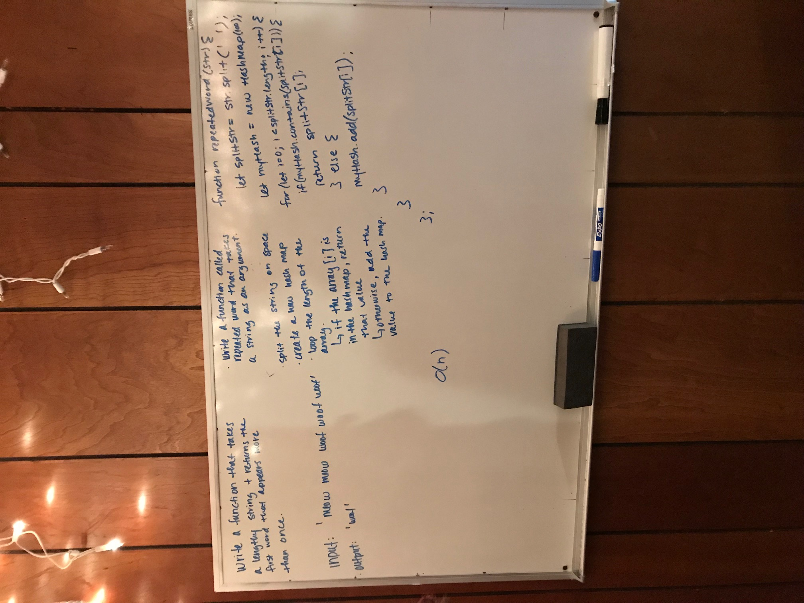

# Hash Maps

## Challenge
### 2/3/19 Per canvas instructions:  

#### Implement a Hashtable with the following capabilities

* A method/function named `add` that takes in both the key and value. This method should hash the key and add the key and value pair to the table.
* A method/function named `find` that takes in the key and returns the value from key/value pair.
* A method/function named `contains` that takes in the key and returns if the key exists in the table already.
* A method/function named `GetHash` that takes in a key and returns the index in the array the key is stored.

## Approach & Efficiency

* Created HashMap class with constructor assigning size (number of buckets) and instantiating a new array the length of the size of the HashMap.
* Created `add`, `find`, `contains`, `GetHash` methods.
* Added tests to test functionality of HashMap class.

## Challenge
### 2/4/19 Per canvas instructions:  

#### Implement a Hashtable with the following capabilities

* Write a function that accepts a lengthy string parameter.
* Without utilizing any of the built-in library methods available to your language, return the first word to occur more than once in that provided string.

#### UML

