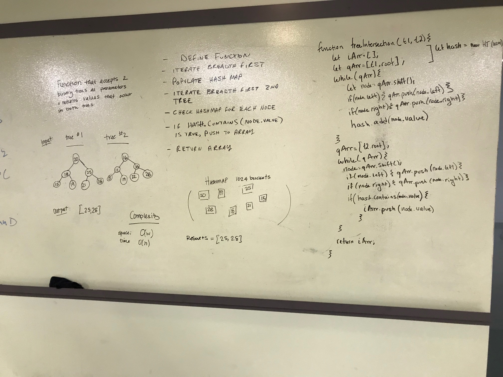
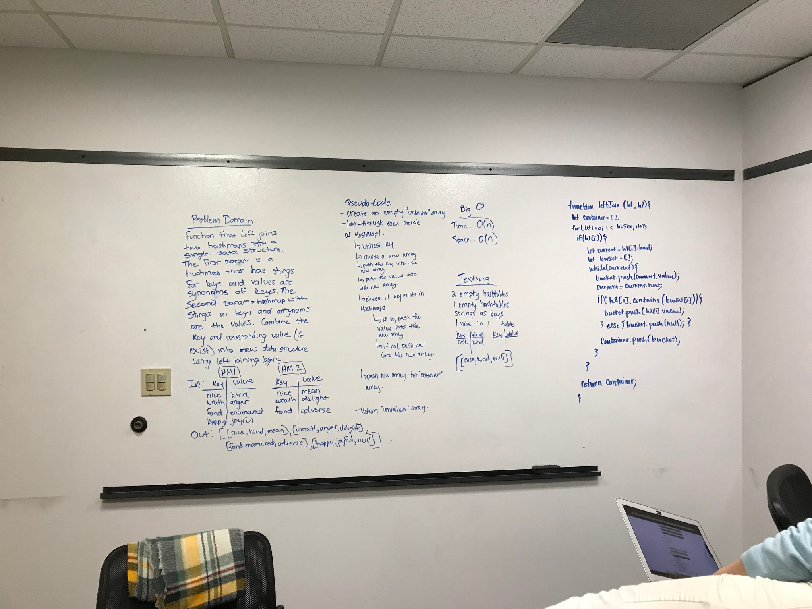

# Hash Maps

## Author:  Heather Cherewaty

## Challenge
### 2/3/19 

#### Implement a Hashtable with the following capabilities

* A method/function named `add` that takes in both the key and value. This method should hash the key and add the key and value pair to the table.
* A method/function named `find` that takes in the key and returns the value from key/value pair.
* A method/function named `contains` that takes in the key and returns if the key exists in the table already.
* A method/function named `GetHash` that takes in a key and returns the index in the array the key is stored.

## Approach & Efficiency

* Created HashMap class with constructor assigning size (number of buckets) and instantiating a new array the length of the size of the HashMap.
* Created `add`, `find`, `contains`, `GetHash` methods.
* Added tests to test functionality of HashMap class.

## Challenge
### 2/4/19  

* Write a function that accepts a lengthy string parameter.
* Without utilizing any of the built-in library methods available to your language, return the first word to occur more than once in that provided string.

#### UML

## Challenge

### Collaborated with:  Hannah Ingham and Jon DiQuattro
### 2/5/19

* Write a function called tree_intersection that takes two binary tree parameters.
* Without utilizing any of the built-in library methods available to your language, return a set of values found in both trees.

## Approach & Efficiency

* Created a function that accepts two binary trees as parameters.
* Traverses first tree and adds to a hashmap.
* Traverses second tree and evaluates if the node value is contained within the hash map.
* Added tests to test functionality.

#### UML

## Challenge

### Collaborated with:  Caity Heath and Lena Eivy
### 2/6/19 

* Write a function that LEFT JOINs two hashmaps into a single data structure.
The first parameter is a hashmap that has word strings as keys, and a synonym of the key as values.
* The second parameter is a hashmap that has word strings as keys, and antonyms of the key as values.
* Combine the key and corresponding values (if they exist) into a new data structure according to LEFT JOIN logic.
* LEFT JOIN means all the values in the first hashmap are returned, and if values exist in the “right” hashmap, they are appended to the result row. If no values exist in the right hashmap, then some flavor of NULL should be appended to the result row.
* The returned data structure that holds the results is up to you. It doesn’t need to exactly match the output below, so long as it achieves the LEFT JOIN logic.
Avoid utilizing any of the library methods available to your language.

## Approach & Efficiency

* Created a function that accepts two hashmaps as parameters.
* Looped through the first hash map, pushing the key/value pair from the first tree into individual arrays.
* Checked if the second hash map contained the key from hashmap (now in an array).  Adding the antonym to the array if keys match, otherwise adding null.
* Pushed each array to a container array.  Returned container array.
* Added tests to assert functionality of joining and null if keys do not match.

#### UML

