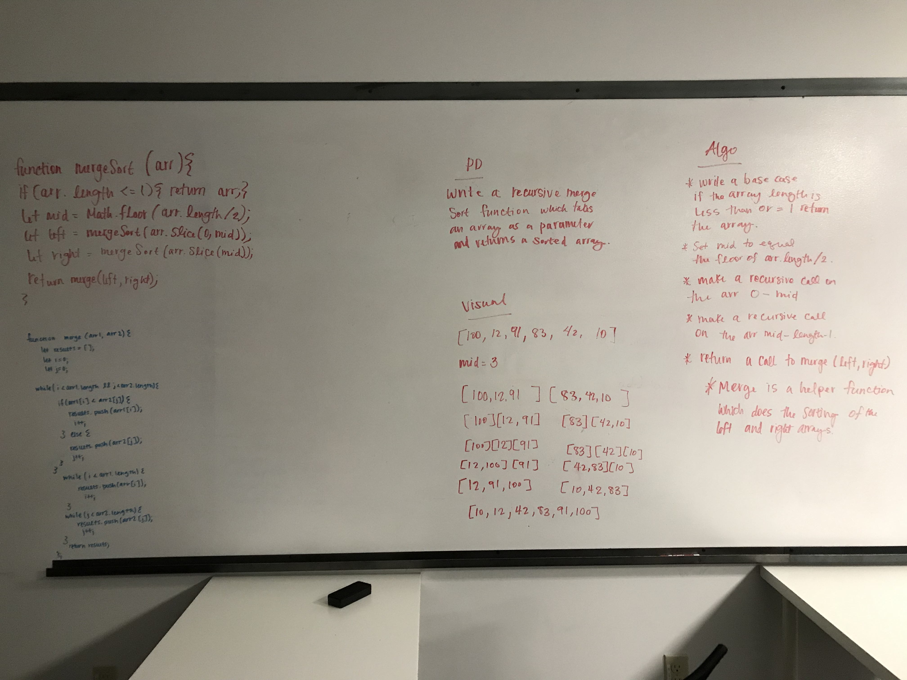

# Merge Sort

## Author:  Heather Cherewaty

### Collaborated with:  Caity Heath

## Challenge
### 2/18/19 

#### Implement a Merge Sort function with the following capabilities

* Write a function that accepts an array of unsorted integers, and returns a sorted array by a recursive mergesort algorithm.

## Approach & Efficiency

* Iterate through array and slice array into individual arrays per integer.
* Merge each array based on comparing which is greater - sorted least to greatest.

#### UML
