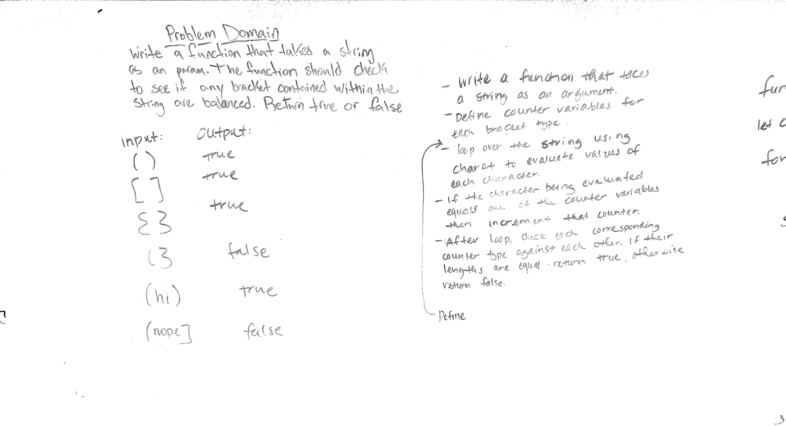
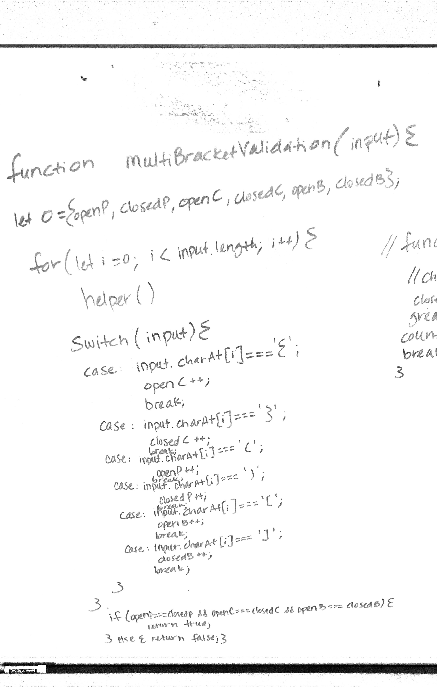
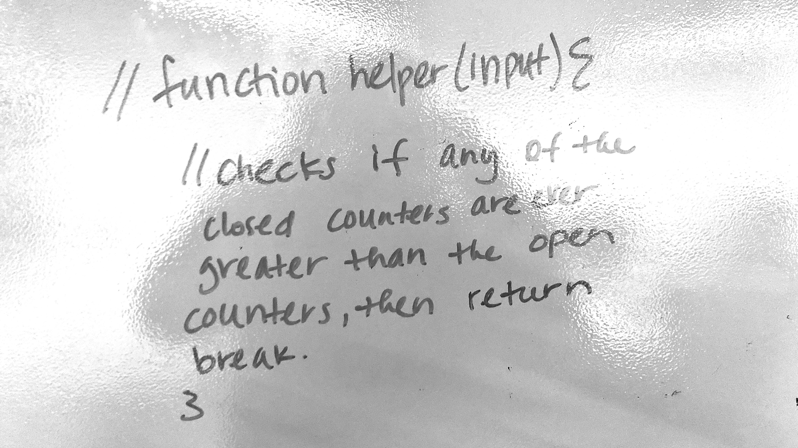

# Multi Bracket Validation Function
01/09/19 -- Heather Cherewaty & George Raymond

## Challenge
### 01/09/19 Per canvas instructions:  

Your function should take a string as its only argument, and should return a boolean representing whether or not the brackets in the string are balanced. There are 3 types of brackets:

Round Brackets : ()
Square Brackets : []
Curly Brackets : {} 

## Approach & Efficiency

* Created multiBracketValidation function.
* Defined variables, accounted for inputs, and tests.
* Made additional test assertions to test the functionality of the function.
* White board.

## Solution

