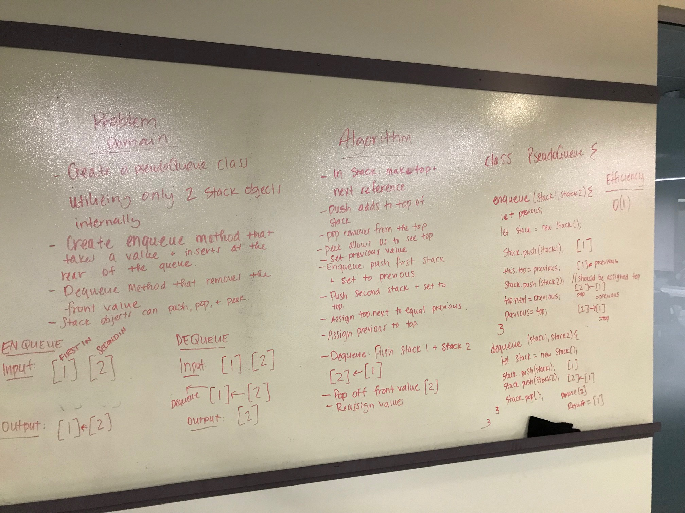

# queueWithStacks
1/7/19 -- Code Challenege 11 - Heather Cherewaty & Lena Eivy

## Challenge
### 1/2/19 Per canvas instructions:  
* Create a brand new `PseudoQueue` class. Do not use an existing Queue. Instead, this PseudoQueue class will implement the standard queue interface, but will internally only utilize 2 Stack objects. Ensure that you create your class with the following methods:

* enqueue(value) which inserts value into the PseudoQueue, using a first-in, first-out approach.
dequeue() which extracts a value from the PseudoQueue, using a first-in, first-out approach.
The Stack instances have only push, pop, and peek methods. You should use your own Stack implementation. Instantiate these Stack objects in your PseudoQueue constructor.

## Approach & Efficiency 
* Examined problem domain
* Visualization
* Formulated algorithm
* Wrote pseudoQueue function
* Wrote checks for function
* Identified Efficiency
* Wrote test assertions 

## Solution
