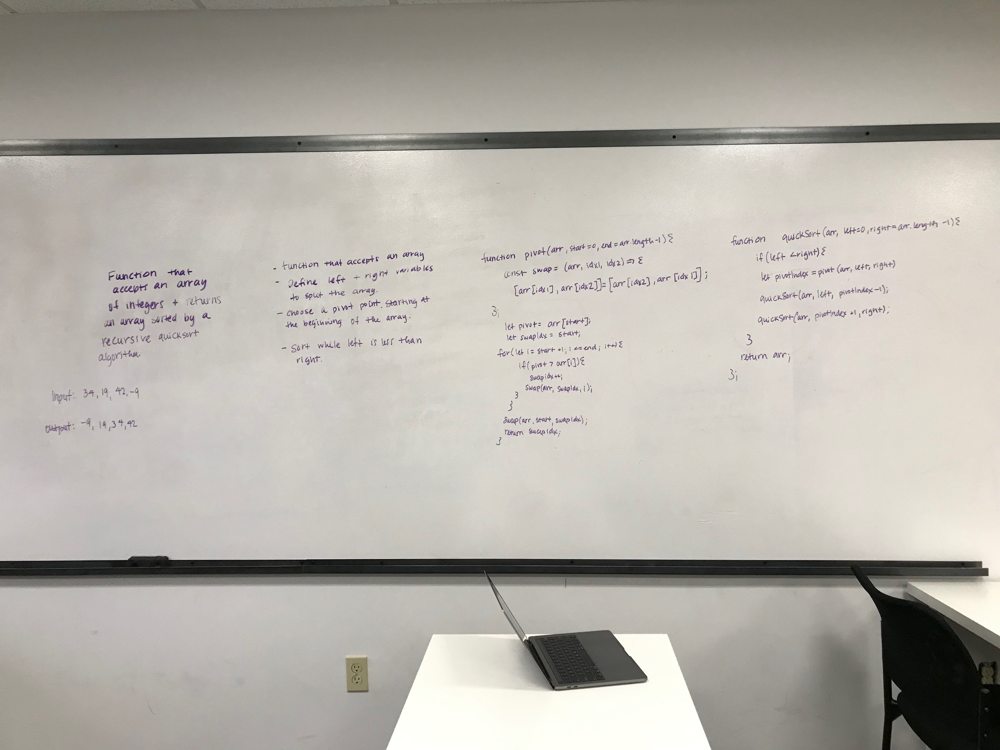

# Quick Sort

### Author: 
Heather Cherewaty

### Collaborated with:
Jared Pattison

### Links and Resources

* [repo](https://github.com/hcherewaty/data-structures-and-algorithms)

## Challenge
* Write a function that accepts an array of integers, and returns an array sorted by a recursive quicksort algorithm.

