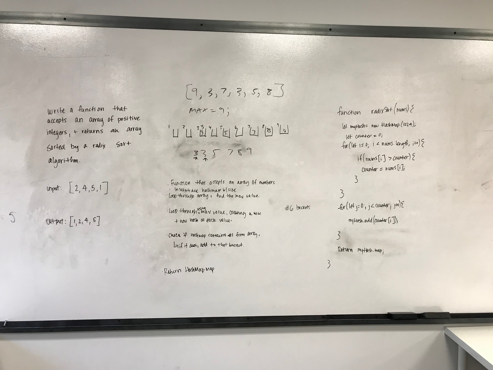

# Radix Sort

## Author:  Heather Cherewaty

### Collaborated with:  Jon DiQuattro

## Challenge
### 2/20/19 

#### Implement a Merge Sort function with the following capabilities

* Write a function that accepts an array of positive integers, and returns an array sorted by a radix sort algorithm.

## Approach & Efficiency

* Find max value of array.
* create buckets for the length of the max number.
* Sort numbers in array into Hashmap
* Return hashmap map.

#### UML
