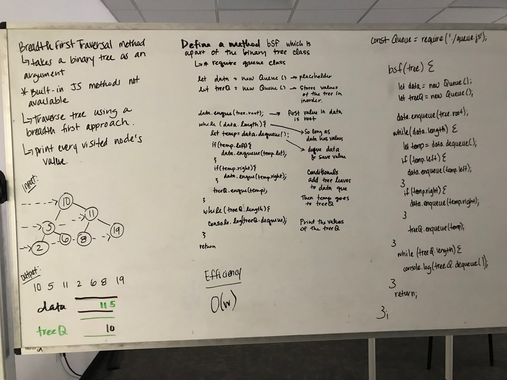

# Trees

### Author: 
Heather Cherewaty

### Links and Resources

* [repo](https://github.com/hcherewaty/data-structures-and-algorithms)

### Modules
#### `tree.js`

#### Running the app
* `npm start`
* Endpoint: `/tree.js`
  * Returns Binary Tree and Binary Search Tree values

#### Tests
* npm test (runs unit tests)
* npm run lint (runs linter tests)

